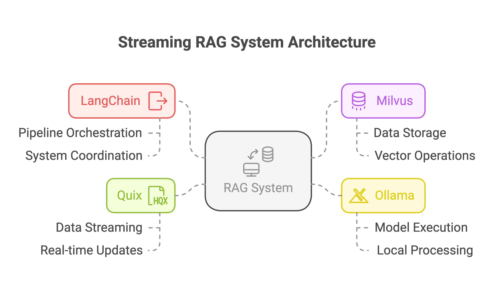

# Real-Time RAG with Milvus, Quix Streams and Mistral



This repository demonstrates a real-time Retrieval Augmented Generation (RAG) system featuring:
- Vector search with Milvus.
- Stream processing using DataFrames with Quix Streams.
- Local LLM inference with Mistral (via Ollama).

## Overview

The demo shows how to:
1. Set up a basic RAG system with LangChain and [Milvus](https://github.com/milvus-io/milvus).
2. Set up streaming data integration with Apache Kafka and [Quix Streams](https://github.com/quixio/quix-streams).
3. Update the knowledge base in real time.
4. Query the system before and after receiving new information.

## Requirements

- Python 3.11+.
- Docker & Docker Compose (for Milvus and Kafka).
- Ollama.
- uv (install with `pip install uv`).

## Quick Start

1. Create a virtual environment and install dependencies:
```bash
uv sync
source .venv/bin/activate
```

2. Start Milvus and Kafka:
```bash
docker compose up -d
```

3. Make sure you have downloaded the `mistral` model, you can do this by running:
```bash
ollama pull mistral
```

4. Open and run the Jupyter notebook:
```bash
jupyter notebook RAG_Streaming_Demo.ipynb
```

## How it Works

1. **Initial Setup**: 
   - Initializes an empty Milvus collection.
   - Sets up LangChain with Mistral LLM.
   - Configures Kafka and a topic.

2. **Demo Flow**:
   - Show initial RAG query (empty knowledge base).
   - Stream sample messages containing new information to Kafka.
   - Process these messages with Quix Streams.
   - Update vector store with new information.
   - Demonstrate improved responses with new knowledge.

## Architecture

```
[Kafka] -> [Quix Streams application] -> [Milvus Vector DB] -> [RAG Chain] -> [Mistral LLM]
```

## Files

- `RAG_Streaming_Demo.ipynb`: Main demo notebook
- `docker-compose.yml`: Milvus and Kafka setup
- `pyproject.toml`: Project dependencies

## Notes

- This is a demo setup focused on clarity over production readiness.
- Uses local LLM inference for simplicity.
- Kafka setup is minimal for demonstration purposes.
